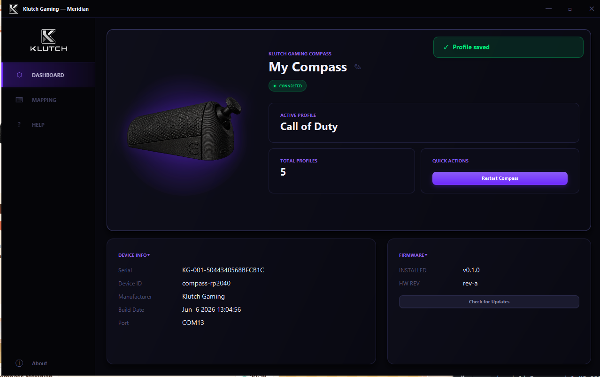

# Meridian

> Configuration app for the [Klutch Gaming Compass](https://klutch-gaming.com)

Meridian is an open source desktop application for Windows that lets you configure your Klutch Gaming Compass joystick device. Customize key mappings, adjust deadzone sensitivity, manage profiles, and monitor device info — all from a clean, native UI.



---

## Features

- **Key mapping** — assign any keyboard key to each direction and the click button
- **Deadzone control** — tune directional and diagonal sensitivity per profile
- **Profile system** — save and switch between up to 10 custom mapping profiles
- **Auto-connect** — detects and connects to your Compass automatically on launch
- **Hotplug support** — reconnects automatically when the device is unplugged and replugged
- **Device info** — view firmware version, hardware revision, serial number, and port
- **System tray** — minimizes to tray, stays running in the background

---

## Requirements

- Windows 10 or Windows 11 (64-bit)
- Java 22 or higher — [Download Corretto 22](https://aws.amazon.com/corretto/)
- A Klutch Gaming Compass device
- WiX Toolset 3.x (for building the installer only) — [Download WiX](https://github.com/wixtoolset/wix3/releases)

---

## Download

Download the latest installer from the [Releases](https://github.com/juviscript/compass-meridian/releases) page.

> **Note:** Windows SmartScreen may show a warning since the app is currently unsigned.
> Click **More info → Run anyway** to proceed. This is expected for indie software
> and will be resolved with a code signing certificate in a future release.

---

## Getting Started (Local Development)

### Prerequisites

- Java 22+ ([Amazon Corretto 22](https://aws.amazon.com/corretto/) recommended)
- Maven 3.8+
- IntelliJ IDEA (recommended) or any Java IDE
- Git

### Clone the repo

```bash
git clone https://github.com/juviscript/compass-meridian.git
cd compass-meridian
```

### Build and run

```bash
mvn clean javafx:run
```

### Run tests

```bash
mvn test
```

### Build the Windows installer

Requires WiX Toolset 3.x installed and on your PATH.

```bash
mvn clean package javafx:jlink jpackage:jpackage
```

The installer will be output to `target/dist/Meridian-0.1.0.exe`.

---

## Project Structure

```
compass-meridian/
├── src/
│   └── main/
│       ├── java/dev/juviscript/compassmeridian/
│       │   ├── MeridianApp.java              # Application entry point
│       │   ├── controllers/                  # JavaFX page controllers
│       │   │   ├── MainController.java       # Root layout, navigation, hotplug
│       │   │   ├── DeviceController.java     # Device dashboard page
│       │   │   ├── MappingController.java    # Key mapping and profiles page
│       │   │   ├── HelpController.java       # Help page
│       │   │   ├── AboutController.java      # About modal
│       │   │   └── SaveProfileModalController.java
│       │   ├── serial/                       # Serial communication layer
│       │   │   ├── CompassSerial.java        # Port discovery, connect, hotplug
│       │   │   └── CompassProtocol.java      # Serial command protocol
│       │   ├── model/                        # Data models
│       │   │   ├── KeyMapping.java           # Key mapping with deadzone values
│       │   │   ├── Profile.java              # Device profile
│       │   │   └── Preset.java              # Built-in preset definitions
│       │   └── utils/                        # Utilities
│       │       ├── Logger.java               # Error file logger
│       │       ├── ToastManager.java         # Toast notification system
│       │       └── UIUtils.java             # JavaFX animation helpers
│       └── resources/dev/juviscript/compassmeridian/
│           ├── main-view.fxml                # Root layout with sidebar
│           ├── device-page.fxml              # Device dashboard
│           ├── mapping-page.fxml             # Key mapping and profiles
│           ├── help-page.fxml                # Help page
│           ├── about-modal.fxml              # About modal
│           ├── save-profile-modal.fxml       # Save profile modal
│           ├── styles.css                    # Full app theme
│           └── assets/                       # Icons, fonts, images
└── pom.xml
```

---

## Architecture

Meridian is a JavaFX desktop application that communicates with the Compass device over USB serial using a simple line-based text protocol.

### Serial Protocol

Commands are sent as plain text over serial at 115200 baud. Each command returns a response terminated by `END`, `OK`, `SAVED`, `RESET`, or `ERROR`.

| Command | Description |
|---|---|
| `GET_INFO` | Returns device name, firmware version, serial number, active profile |
| `GET_CONFIG` | Returns current key mapping and deadzone values |
| `SET <direction> <key>` | Sets a key mapping (up/down/left/right/click) |
| `SET_DEADZONE main <value>` | Sets directional deadzone (50–150) |
| `SET_DEADZONE diagonal <value>` | Sets diagonal deadzone (30–100) |
| `SET_NAME <name>` | Sets the device display name |
| `SAVE` | Persists current config to device flash |
| `RESET` | Resets config to factory defaults |
| `RESTART` | Reboots the device |
| `GET_PROFILES` | Lists all profiles (built-in and custom) |
| `SAVE_PROFILE <name>` | Saves current mapping as a named profile |
| `LOAD_PROFILE <filename>` | Loads a profile by filename |
| `DELETE_PROFILE <filename>` | Deletes a custom profile |
| `RENAME_PROFILE <old> <new>` | Renames a custom profile |

### Device Detection

Meridian identifies a Compass by its USB serial number prefix `KG-`. If no `KG-` device is found it falls back to matching on VID `0x2E8A` (Raspberry Pi / RP2040). This prevents accidental connection to other RP2040 devices.

### Key Mapping

Keys are stored on the device as single characters or named strings:

```
Single chars: w a s d i j k l (and any other single key)
Special keys: UP DOWN LEFT RIGHT SPACE ENTER TAB ESC
              SHIFT CTRL ALT GUI CAPSLOCK
              F1-F24
              DELETE INSERT HOME END PAGEUP PAGEDOWN
              COMMA PERIOD SLASH SEMICOLON QUOTE
              BACKSLASH MINUS EQUALS LBRACKET RBRACKET GRAVE
```

### Deadzone

The deadzone controls how far the joystick must move before a keypress registers. Higher values mean less sensitive. Two separate deadzones are configurable:

- **Directional** (50–150, default 120) — primary axis threshold
- **Diagonal** (30–100, default 60) — secondary axis threshold when already moving in one direction

### Profiles

The Compass stores up to 10 custom profiles plus 3 built-in profiles (WASD, Arrow Keys, IJKL) in LittleFS flash memory. Each profile includes the full key mapping and deadzone values.

### Debug Log

Meridian logs errors to:
```
%APPDATA%\Meridian\meridian.log
```

Rotates at 1MB, keeps last 3 files.

---

## Tech Stack

| Technology | Version | Purpose |
|---|---|---|
| Java | 22 | Language |
| JavaFX | 24.0.1 | UI framework |
| jSerialComm | 2.10.4 | Serial port communication |
| Maven | 3.8+ | Build tool |
| jpackage | JDK built-in | Windows installer |

---

## Contributing

Contributions are welcome! Please open an issue first to discuss what you'd like to change.

1. Fork the repo
2. Create a feature branch (`git checkout -b feat/your-feature`)
3. Commit your changes
4. Push to the branch
5. Open a Pull Request

---

## License

[MIT](LICENSE) © 2026 Juviscript / Klutch Gaming

---

## Support

- **Issues:** [github.com/juviscript/compass-meridian/issues](https://github.com/juviscript/compass-meridian/issues)
- **Email:** support@klutch-gaming.com
- **Website:** [klutch-gaming.com](https://klutch-gaming.com)
